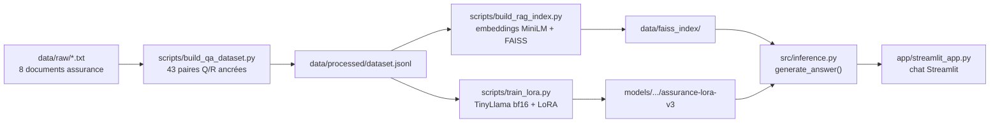

# 🛡️ Assurance LLM Assistant


-2C5C55)


Assistant IA spécialisé dans le domaine de l'**assurance et des sinistres**, combinant un **LLM fine-tuné avec LoRA (QLoRA)** et un système **RAG (FAISS)** pour répondre à des questions métier en s'appuyant sur de vrais documents, via une interface **Streamlit**.

Projet pédagogique conçu pour tourner de bout en bout sur une machine modeste (CPU, 8 Go de RAM) — un cas d'étude complet plutôt qu'un produit fini : chaque choix technique (taille du modèle, quantization, format du dataset) est documenté et assumé.

---

## Sommaire

- [Architecture](#-architecture)
- [Le modèle](#-le-modèle--lora--qlora)
- [Le RAG](#-le-rag)
- [Installation & démarrage](#-installation--démarrage)
- [Cas d'usage métier](#-cas-dusage-métier)
- [Stack technique](#️-stack-technique)
- [Structure du projet](#-structure-du-projet)
- [Limites connues & pistes d'amélioration](#-limites-connues--pistes-damélioration)

---

## 🏗️ Architecture



Deux chemins partent du même dataset : l'un **indexe les faits** à retrouver au moment de la question (RAG), l'autre **apprend le style et le format de réponse** (LoRA). `inference.py` recombine les deux à chaque requête.

---

## 🧠 Le modèle — LoRA / QLoRA

| Paramètre | Valeur |
|---|---|
| Modèle de base | `TinyLlama/TinyLlama-1.1B-intermediate-step-1431k-3T` |
| Méthode | LoRA (PEFT) — base gelée, `bfloat16` |
| Rang (`r`) | 16 |
| `lora_alpha` | 32 |
| Modules ciblés | `q_proj`, `v_proj` |
| Paramètres entraînables | 2 252 800 / 1 102 301 184 (**0.2 %**) |
| Dataset | 43 paires question/contexte/réponse écrites à la main |

**Pourquoi TinyLlama-1.1B plutôt qu'un modèle plus grand ?** Un choix de contrainte matérielle assumé : sur une machine à 8 Go de RAM sans GPU, un modèle 7-8B (Mistral, Llama-3) rend l'entraînement et même l'inférence peu fiables. TinyLlama tient confortablement, se fine-tune en ~1h30 sur CPU, et permet d'itérer plusieurs fois dans la même journée.

**Pourquoi bf16 direct plutôt que la quantization 4-bit à l'entraînement ?** `bitsandbytes` en 4-bit sur CPU s'est montré peu fiable en pratique (pic mémoire au chargement, calcul très lent lors du backward — voir *Limites* plus bas). Le chargement direct en `bfloat16` s'est révélé plus rapide et plus stable pour ce modèle, au prix d'un peu plus de RAM utilisée.

Le template de prompt (`format_conversation_prompt`, dans `src/utils.py`) est **strictement identique** à l'entraînement et à l'inférence — un point critique : un LLM fine-tuné associe une forme de prompt précise à une forme de réponse, un template différent casse cette association.

---

## 🔍 Le RAG

- **Embeddings** : `sentence-transformers/all-MiniLM-L6-v2` (384 dimensions)
- **Index** : FAISS `IndexFlatIP` + normalisation L2 (= similarité cosinus), recherche exacte — adapté à un corpus de cette taille (35 contextes uniques), pas pensé pour scaler à des millions de documents
- **Corpus** : les contextes factuels des 43 exemples du dataset (mêmes phrases sources que celles utilisées à l'entraînement, pour rester cohérent)

---

## 🚀 Installation & démarrage

```bash
git clone https://github.com/falilou14/assurance-llm-assistant.git
cd assurance-llm-assistant

python -m venv .venv
.venv\Scripts\activate      # Windows -- source .venv/bin/activate sous Linux/Mac

pip install -r requirements.txt
```

> ⚠️ Les poids de l'adaptateur LoRA et les données ne sont **pas versionnés** (voir `.gitignore`) — il faut reconstruire le dataset, l'index RAG et ré-entraîner l'adaptateur avant de lancer l'app.

```bash
# 1. Construire le dataset question/réponse à partir de data/raw/
python scripts/build_qa_dataset.py

# 2. Construire l'index FAISS pour le RAG
python scripts/build_rag_index.py

# 3. Entraîner l'adaptateur LoRA (~1h30 sur CPU, TinyLlama-1.1B)
python scripts/train_lora.py

# 4. Lancer l'interface
streamlit run app/streamlit_app.py
```

L'app est ensuite disponible sur `http://localhost:8501`.

---

## 📌 Cas d'usage métier

| Usage | Exemple de question |
|---|---|
| **Agent / gestionnaire** — comprendre une couverture, une clause | *"Le contrat auto formule tiers étendu couvre-t-il un bris de glace arrière ?"* |
| **Client déclarant un sinistre** — étapes, pièces justificatives, délais | *"Que dois-je faire si j'ai un dégât des eaux dans mon appartement ?"* |
| **Centre d'appel** — questions administratives récurrentes | *"Quelles sont les exclusions courantes en assurance habitation ?"* |
| **Formation / documentation** — expliquer une notion, un terme | *"Explique-moi la différence entre un dommage corporel et matériel."* |
| **Analyse de documents** — résumer une procédure interne | *"Résume-moi les obligations de l'assuré selon ce document."* |
| **Aide à la décision** — synthétiser, comparer des cas | *"Liste les éléments à vérifier lors d'un accident non responsable."* |

---

## 🏗️ Stack technique

| Technologie | Rôle |
|---|---|
| **Python** | Langage principal |
| **Transformers (Hugging Face)** | Chargement et génération du LLM |
| **PEFT (LoRA)** | Fine-tuning léger, paramètre-efficient |
| **bitsandbytes** | Quantization 4-bit (utilisée à l'inférence légère, pas à l'entraînement) |
| **FAISS** | Index vectoriel pour le RAG |
| **Sentence-Transformers** | Embeddings des documents et des requêtes |
| **Streamlit** | Interface de chat |
| **PyTorch** | Backend de calcul (CPU) |

---

## 📁 Structure du projet

```
assurance-llm-assistant/
├── app/
│   └── streamlit_app.py        # Interface de chat
├── data/
│   ├── raw/                    # Documents source (.txt)
│   └── processed/               # dataset.jsonl (non versionné)
├── models/                      # Adaptateurs LoRA entraînés (non versionné)
├── scripts/
│   ├── build_qa_dataset.py     # Construit le dataset Q/R
│   ├── build_rag_index.py      # Construit l'index FAISS
│   └── train_lora.py           # Entraîne l'adaptateur LoRA
├── src/
│   ├── dataset_builder.py
│   ├── inference.py
│   ├── lora_training.py
│   ├── preprocessing.py
│   ├── rag_pipeline.py
│   └── utils.py
├── notebooks/                   # Exploration -- pas la source de vérité (voir ci-dessous)
└── .streamlit/config.toml       # Thème de l'interface
```

> Les notebooks (`01_preprocessing`, `02_training_lora`, `03_evaluation`) datent d'une version antérieure du pipeline et ne sont plus synchronisés avec le code actuel (`scripts/`). Tout l'entraînement et la construction du dataset se font désormais via des scripts autonomes, plus fiables à relancer et à déboguer.

---

## ⚠️ Limites connues & pistes d'amélioration

- **Dataset volontairement restreint** (43 exemples) : suffisant pour démontrer le pipeline de bout en bout, pas pour couvrir tous les cas métier réels. Un dataset plus grand et plus varié améliorerait nettement la robustesse des réponses.
- **Générations longues** : le modèle peut partir en légère répétition après une première phrase correcte (pas d'hallucination, plutôt une absence de point d'arrêt appris) — limiter `max_new_tokens` atténue le problème.
- **CPU only** : chaque réponse prend 10 à 30 secondes ; pas de cache entre redémarrages du serveur (mis en cache seulement au sein d'une session Streamlit via `st.cache_resource`).
- **`bitsandbytes` en 4-bit peu fiable pour l'entraînement CPU** : pic mémoire élevé au chargement, calcul lent lors du backward — l'entraînement utilise `bfloat16` direct à la place ; la 4-bit reste utilisable pour de l'inférence simple.
- **RAG à petite échelle** : `IndexFlatIP` (recherche exacte) convient à ce corpus, mais ne scalerait pas à des millions de documents (nécessiterait IVF ou HNSW).
- **Pas d'évaluation automatisée** (type RAGAS) encore en place — les tests actuels sont manuels, sur un petit jeu de questions de contrôle.

---

## Auteur

Projet réalisé par [@falilou14](https://github.com/falilou14) dans le cadre d'une montée en compétences sur les LLM (RAG, fine-tuning LoRA/QLoRA, quantization) — voir la section *Limites* ci-dessus pour une vision honnête de l'état du projet.
